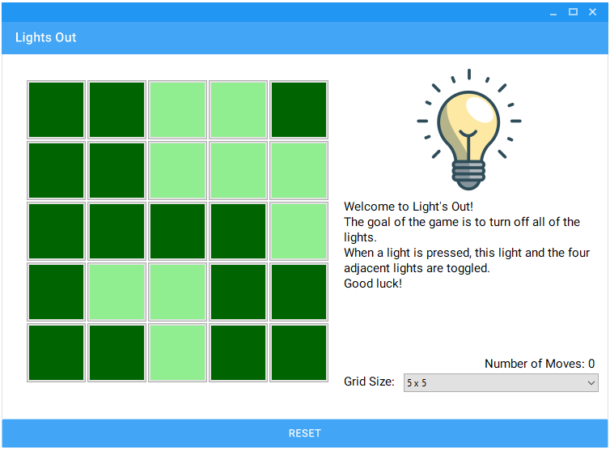
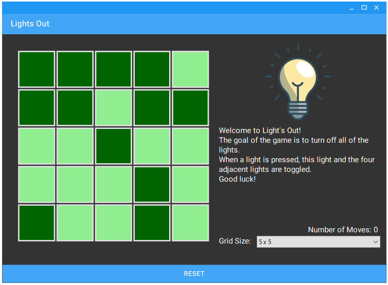
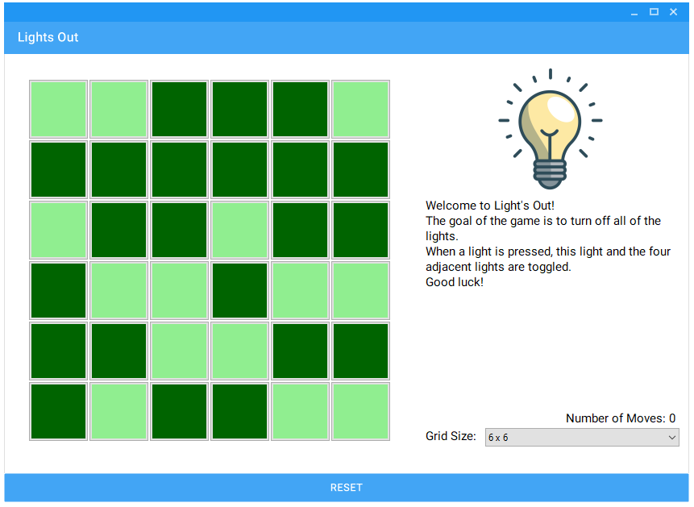
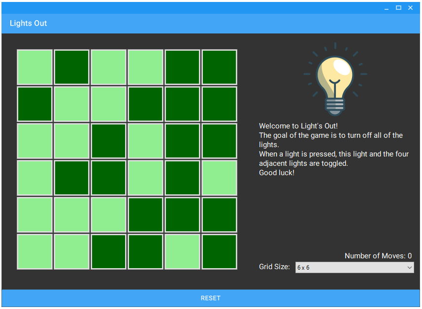

<div align="center">

  
  <h1>Lights Out</h1>
  
  <p>
    Implementation of the Lights Out Game using C# Forms.
  </p>
</div>

<br />

<!-- Table of Contents -->
# 📔 Table of Contents
- [About the Project](#star2-about-the-project)
  * [Screenshots](#camera-screenshots)
  * [Tech Stack](#space_invader-tech-stack)
  * [Features](#dart-features)
- [Getting Started](#toolbox-getting-started)
  * [Prerequisites](#bangbang-prerequisites)
  * [Run Locally](#running-run-locally)
  * [Running Tests](#test_tube-running-tests)
  * [Deployment](#triangular_flag_on_post-deployment)
- [Roadmap](#compass-roadmap)
- [Contributing](#wave-contributing)
  * [Code of Conduct](#scroll-code-of-conduct)
- [FAQ](#grey_question-faq)
- [License](#warning-license)
- [Contact](#handshake-contact)
- [Acknowledgements](#gem-acknowledgements)

  

<!-- About the Project -->
## :star2: About the Project

The player is presented with a grid of lights that are either on or off to begin with. The goal of Lights Out is to turn off all of the lights by clicking on them to switch them on or off. Each light that is clicked by the player toggles that light as well as toggling adjacent lights from the clicked light (Up, down, left, right)

<!-- Screenshots -->
### :camera: Screenshots

<div align="center"> 
  
  
  
  
</div>


<!-- TechStack -->
### :space_invader: Tech Stack

<details>
  <summary>Solution</summary>
  <ul>
    <li><a href="https://visualstudio.microsoft.com/downloads/">C#</a></li>
    <li><a href="https://dotnet.microsoft.com/en-us/download/dotnet/3.1">.NET Core 3.1</a></li>
  </ul>
</details>

<!-- Features -->
### :dart: Features

- Play the classic Lights Out game right on your desktop!
- Adjustable grid size to allow for a bigger challenge
- Toggle between Light and Dark modes

<!-- Getting Started -->
## 	:toolbox: Getting Started

<!-- Prerequisites -->
### :bangbang: Prerequisites
   
    - C#
    - .Net Core 3.1
    - Visual Studio

<!-- Run Locally -->
### :running: Run Locally

Clone the project

```bash
  git clone https://github.com/Scottd125/LightsOut.git
```

Go to the project directory

```bash
  cd LightsOut
```

Open the Solution File

```bash
  LightsOut.sln
```

Run the Project

<!-- Running Tests -->
### :test_tube: Running Tests

The solution's unit tests can be ran from inside Visual Studio's test runner. Tests > Run All Tests

<!-- Deployment -->
### :triangular_flag_on_post: Deployment

<!-- TODO -->
WIP

<!-- Roadmap -->
## :compass: Roadmap

<!-- TODO -->
WIP

<!-- Contributing -->
## :wave: Contributing

<a href="https://github.com/Scottd125/LightsOut/graphs/contributors">
  
</a>

Contributions are always welcome!

<!-- TODO -->
<!-- See `contributing.md` for ways to get started. -->


<!-- Code of Conduct -->
### :scroll: Code of Conduct

<!-- TODO -->
WIP
<!-- Please read the [Code of Conduct](https://github.com/Scottd125/LightsOut/blob/master/CODE_OF_CONDUCT.md) -->

<!-- FAQ -->
## :grey_question: FAQ

<!-- TODO -->
WIP

<!-- License -->
## :warning: License

Distributed under the GNU General Public License v3.0. See LICENSE for more information.

<!-- Contact -->
## :handshake: Contact

<!-- TODO -->
WIP

<!-- Acknowledgments -->
## :gem: Acknowledgements

 - [MaterialSkin](https://github.com/IgnaceMaes/MaterialSkin)
